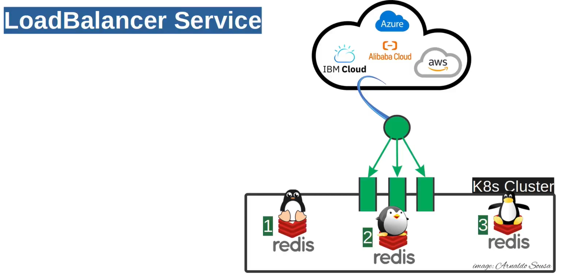
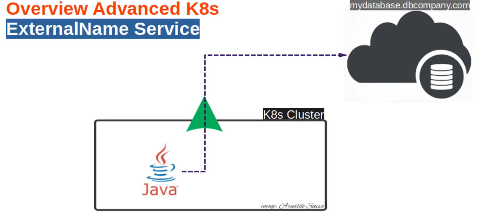
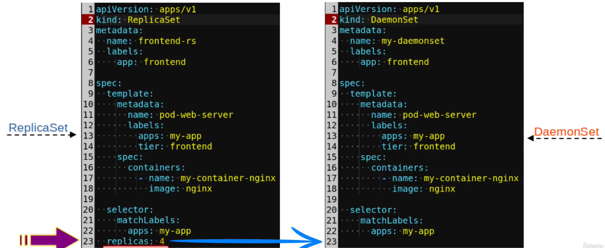

## 🫛 Pods

### Criando pods imperativamente

- kubectl get pods
- kubectl get pods --all-namespaces
- kubectl run my-pod-apache-server --image httpd
- kubectl get pods -o wide
- kubectl delete pod my-pod-apache-server (Como só existe o manifesto do pod, o mesmo é excluído permanentemente)

### Criando pods usando manifesto

- kubectl apply -f pod.yaml
- kubectl delete pod my-pod-webserver
- kubectl delete --all pods && kubectl get pods
- watch kubectl get pods

Quando deletamos um pod e ele é recriado, o replicaSet que está garantindo que esse pod seja recriado.

---

## 🔁 ReplicaSets

- kubectl get replicaset
- kubectl apply -f Udemy/replicaSet.yaml
- kubectl delete replicaset frontend-rs

**Editando de forma imperativa**

- kubectl scale replicasets frontend-rs --replicas=5

Ao excluir o replicaset, todos os pods que ele estava controlando são deletados.

Manipulamos a quantidade de replicas, fazemos o apply e Kubernetes se encarrega de aplicar as replicas especificadas no yaml.

---

## 🏗️ Deployment

- Faz a implantação da aplicação
- Usa estratégia Rolling Update como default. (default 25% de indispinibilidade dos pods)
- Outra estratégia Recreate Deployment (Causa indisponibilidade)
- Rollback

- Deployment cria tanto o pod quanto o replicaset

**Comandos**

- kubectl apply -f Udemy/deployment.yaml
- kubectl rollout status deployment.apps/frotend-deployment
- kubectl rollout history deployment.apps/frontend-deployment
- kubectl describe deployment frontend-deployment
- kubectl describe deployment frontend-deployment | grep StrategyType

### Estratégias de deploy `RollingUpdate`

A estratégia `RollingUpdate` permite que atualizações sejam feitas gradualmente, sem indisponibilizar toda aplicação.

- `maxUnavailable: 25%`: Durante o update, **até 25% dos pods podem ficar indisponíveis** temporariamente.
  👉 Se você possui **4 pods, até 1 pod** pode ser derrubado por vez para atualização `(25% de 4 = 1)`

- `maxSurge: 25%`: Durante o update, o Kubernetes pode criar **até 25% de pods extras**, além do número desejado de réplicas.  
  👉 Com **4 pods definidos**, o cluster pode subir **1 pod extra** durante a atualização `(25% de 4 = 1)`, totalizando temporariamente **5 pods**

**📌 Resumo com 4 réplicas:**

- Até **1 pod pode estar fora do ar** duarante o update `(maxUnavailable)`
- Até **1 pod extra pode ser criado**, somando até **5 pods simultaneamente** `(maxSurge)`
- Esses pod extra **não estará indisponível**, mas sim **em fase de preparação** (como `Pending`, `ContainerCreating`, etc.) até se tornar `Ready`

### Rollout status e Rollout history

```bash
kubectl rollout status deployment/frontend-deployment
```

Verificando o histórico de revisões de um Deployment

O comando abaixo exibe o histórico de revisões do Deployment `frontend-deployment`

```bash
kubectl rollout history deployment/frontend-deployment
```

Cada revisão **_REVISION_** representa uma modificação relevante no Deployment. Vale destacar que **alterar apenas quantidade de réplicas** e reaplicar o manifest **não gera uma nova revisão**, pois o Kubernetes não considera isso uma mudança estrutural na especificação do Deployment.  
Por outro lado, **alterar a imagem do container** (por exemplo, modificando a tag da imagem) **gera uma nova revisão**, pois o Kubernetes entende que isso altera o comportamento da aplicação. Esse mecanismo é semelhante ao controle de versões em sistemas como o Git, em que cada alteração relevante cria um novo "commit"

- Verificar rollout de uma versão específica
  `kubectl rollout history deployment/frontend-deployment --revision=2`

**Rollback**

O comando abaixo executa o rollback para revision anterior:

```bash
kubectl rollout undo deployment/frontend-deployment
```

O comando a seguir executa o rollback de uma revision específica:

```bash
kubectl rollout undo deployment/frontend-deployment --to-revision=5
```

**Rollout Pause e Rollout Resume**

O comando abaixo pausa uma atualização:

```bash
kubectl rollout pause deployment/frontend-deployment
```

O comando **resume** faz par com o comando **pause**, dando continuidade na atualização que foi temporariamente interrompida.

```bash
kubectl rollout resume deployment/frontend-deployment
```

### Scale Up e Scale Down

- **Up**

```bash
kubectl scale deployment/frontend-deployment --replicas=11
```

- **Down**

```bash
kubectl scale deployment/frontend-deployment --replicas=5
```

### Estratégias de deploy `Recreate`

Lembrando que a estratégia default do Kubernetes é a **_RollingUpdate_**

- Alterar o tipo de estratégia dentro da **spec** no deployment.yaml

```yaml
strategy:
  type: Recreate
```

---

## 🛜 Kubernetes Networking

- Container to Container
- Pod to Pod Intra Node.
- Pod to Pod Inter Node.
  O Kubernetes provê uma rede virtual plana dentro do cluster, garantindo que todos os pods possam se comunicar entre si de forma transparente, independentemente de estarem em worker nodes on-premises ou em ambientes de nuvem pública, como AWS ou Azure, desde que estejam integrados ao mesmo cluster.

**Exercício**

- Criar yamls de pods do tomcat e redis.
- Descrever o pod do redis em busca do IP: `kubectl describe pod | grep IP`
- No pod do tomcat, instalar pacote de redes para teste de ping: `apt update -y && apt install iputils-ping`
- Entrar no pod do tomcat: `kubectl exec -it tomcat-pod -- bash`
- Por fim, executar o ping para o IP do pod do redis: `ping <ip-redis>`

## 🗂️ Namespaces

- Usado para fazer uma organização lógica dentro do cluster
- Mecanismo para isolar grupos de recursos dentro de um cluster. (argocd, istio-system, tools, etc)
- Não é permitido aninhamento de namespaces, ou seja, um namespace dentro do outro.

**Comandos**

- kubectl get ns
- kubectl get pods -n default
- kubectl get pods -n kube-system (Vários pods executando neste namespace estrutural do kubernetes)
- kubectl create namespace frontend --save-config
- kubectl apply -f Udemy/networking/tomcat.yaml --namespace=frontend
- kubectl config set-context --current --namespace=frontend **Alterando o namespace default, agora passa a ser frontend**
- kubectl apply -f Udemy/backend-namespace.yaml **Criando namespace através de arquivo de manifesto**
- kubectl apply -f Udemy/networking/redis.yaml -n backend-ns

## 📨 Services

### ClusterIP

- Serviço Padrão do Kubernetes.
- Usado para comunicação interna do cluster.
- Acessível apenas dentro do cluster.
- Não é possível acessá-lo de forma externa sem um proxy.

- **port** Qual porta o serviço será disponibilizado.
- **targetPort** Porta disponibilizada pela aplicação dentro do container. Caso não seja declarado, usará o mesmo que **port**

- Pods não trabalham com IP's estáticos, ou seja, sempre que são reiniciados, seus IP's mudam.
- Por isso importância do service, o client chama o service, sem se preocupar os IP's do pod.
- Ai que entra o Kube-DNS. Resolve os caminhos até o pod.

**Prática**

1. Executar aplicação dos manifestos:
   kubectl apply -f Udemy/serviceClusterIP/pod.yaml
   kubectl apply -f Udemy/serviceClusterIP/service.yaml

2. Criar um outro pode de forma imperativa: `kubectl run -it debian-pod --image=debian bash`

- Executar `apt update`
- Executar `apt install curl -y`
- Executar curl no serviço `curl 10.108.130.220:80 `.
- `kubectl get services --all-namespace -o wide`

### NodePort Service

É aberto uma porta em nosso node para que possa ter acesso ao "mundo" exterior ao cluster.

**Atributos Obrigatórios/Opcional**

- port -> Obrigatório
- targetPort -> Opcional (Se omitido, será assumido valor de port)
- nodePort -> Opcional (Se for omitido será preenchido com valor aleatório de portas: 30000 até 32767)


- Acessar aplicação via NodePort
  curl http://localhost:30008

- Formas de obter IPS do node:
  kubectl get nodes -o wide (INTERNAL-IP)
  kubectl get nodes -o yaml | grep address
  addresses: - address: 192.168.65.3 - address: docker-desktop

### LoadBalancer Service

- Serviço atrelado à nuvem publica.
  

- Recomendado uso com Cloud Controller Manager (C-CM)

- Implementando serviço load balancer
  `type: LoadBalancer`

### ExternalName

- Acesso a um banco de dados externo, por exemplo.
- Acesso de dentro para fora do cluster.
  

## 🩺🔍 LivenessProbe

- Verificadores de sanidade..
- Executados pelo agente kubelet
- Ação de restarting container
- Pode verificar um deadlock

**Apply Pod com Liveness**

`kubectl apply -f Udemy/LivenessProbe/pod.yaml && sleep 5 && kubectl get pods && sleep 30 && kubectl describe pod liveness-pod && sleep 35 && kubectl describe pod liveness-pod && sleep 30 && kubectl describe pod liveness-pod && kubectl get pods liveness-pod`

## Resources

### Requests

- Recursos Mínimos (CPU, Mem) necessário para a aplicação (contêiner).
- Os recursos são requisitados por contêineres, não por pod.
- Recursos requisitados com base na soma de todos contêineres dentro do pod.
- Escalador k8s. Garante que a somatória de todos os pods não exceda a capacidade do node.

### Limits

- Define o máximo de recurso que o contêiner pode usar.

## Volumes

- Diretório que nossos contêineres usarão para guardar e acessar arquivos.

- Não há limites para quantidade de volumes de um pod.
- Volumes efêmeros: Ligado a vida útil do pod.
- Persistent Voluments:
- Volume Mount: Caminho de montagem do volume.
- emptyDir: Tipo de volume efêmero, ligado a vida útil do pod. Em restart de contêiner ele continua vivo.

- Entrar no volume, escrever em um arquivo: `echo "oi volume" >> test.txt`

- Instalar: `apt install procps -y`

- Comando: `ps aux` listará os processos dentro do pod.

- Finalizar o container redis: `kill 1`

- kubectl get pod: `redis-pod       1/1     Running   1 (12s ago)   18m`

**O arquivo ainda está lá no volumes**

```bash
root@redis-pod:/my-volume# ls
test.txt
```

- Deletando o Pod: `kubectl delete pod redis-pod`
- O volume foi recriado, logo, não temos mais o arquivo test.txt

### Volume: hostPath

- Volume que resiste o restart de contêiner.
- Também resiste caso o pod venha ser removido e recriado.
- Volume que consegue uma presistência de dados.
- Persistência feita dentro do worker node (Node File System)
- Os dados permanecerão até que o worker seja removido, ou deletados manualmente.

**Criar o manifesto**

- `kubectl apply -f Udemy/VolumesHostPath/pod.yaml`
- `kubectl exec -it redis-pod -- bash`
- `cd my-data`
- echo "HostPaht" >> hostpath.txt

**Agora, já que estamos usando HostPath, vamos encontrar o arquivo no Worker (/var/lib/2-persist)**

- Como estou usando docker desktop, preciso do seguinte passo para acessar o diretório no "worker"

1. Executar:

```bash
docker run -it --privileged --pid=host justincormack/nsenter1
```

2. `cd /var/lib/2-persist`

3. `cat hostpath.txt`

## DaemonSets

- Fortemente ligado ao node
- Programa executado continuamente em segundo plano.
- Geralmente udados para:
  - Logs
  - Monitoração
  - Dectar invasões
- Consegue replicar pod em cada node.
- Se eu tiver 100 nodes, o daemonset, irá aplicar o pod em questão em todos estes nodes.
- Parecido com o replicaset, note a semelhança entre os manifestos:
  

### kind com 3 nodes

- No docker desktop, ativar kind com 3 nodes.
- Aplicar manifesto do DaemonSet: `kubectl apply -f Udemy/DaemonSet/daemonset.yaml `

- Get Daemonset. `kubectl get ds`
- Ver pods nos nodes: `kubectl get pods -o wide`
- O pod criado através do DaemonSet, fica sob sua tutela, logo, ao tentar excluir o pod, o mesmo será criado novamente.
