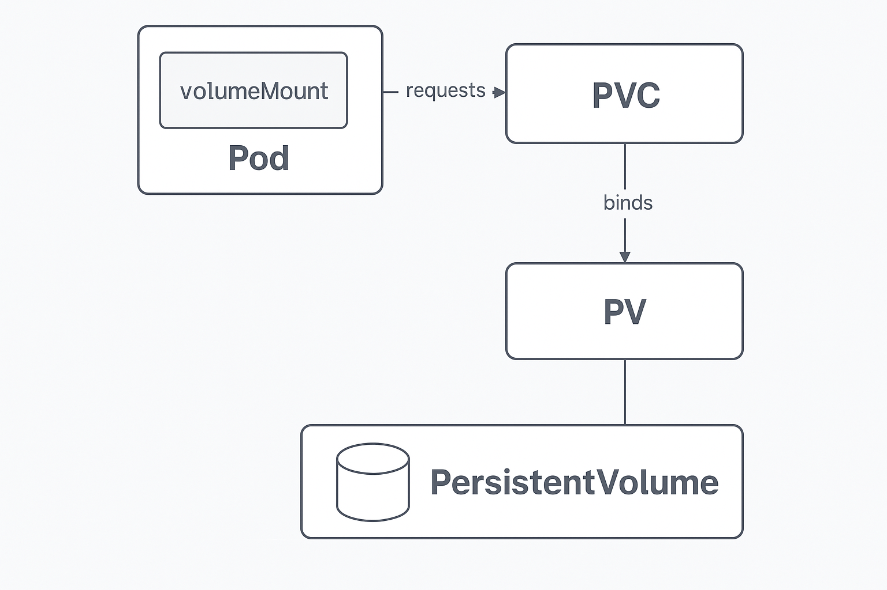

# 📚 Fundamentos de Kuberntes

---

## 🎯 O que é o Kubernetes?

O **Kubernetes** é uma ferramenta de orquestração de containers.

- Open Source
- Altamente utilizada pelas empresas.
- Gerencia todo ciclo de vida de um container

## 🛡️ Imutabilidade no Kubernetes

A **imutabilidade** é uma característica essencial no Kubernetes que promove a **alta disponibilidade** e a **resiliência** das aplicações. Em vez de modificar objetos existentes, o Kubernetes substitui-os por **novas versões**. Isso garante que:

- As **atualizações** (como novas imagens ou configurações) não causem indisponibilidade em produção.
- O estado anterior possa ser recuperado facilmente, permitindo **rollbacks seguros**.
- Cada alteração resulte em um **novo objeto ou versão**, mantendo o histórico de mudanças sob controle (ex: _ReplicaSet, Deployment_).

Esse comportamento está alinhado com os princípios de **infraestrutura imutável** e **automação contínua**, tornando os sistemas mais confiáveis e previsíveis em ambientes dinâmicos.

## 📦 PersistentVolume

O **PersistenteVolume** (PV) é um recurso do cluster Kubernetes que representa **um pedaço de armazenamento físico**(como um disco local, NFS, EBS, etc.) **provisionado de forma independente dos pods**. Ele é criado pelo administrador (estaticamente) ou de forma dinâmica por um _StorageClass_

- Tipo: **Recurso do cluster**
- Independente de pods
- Criado manualmente ou automaticamente via `StorageClass`
- Define: capacidade, acesso (ReadWriteOnce, etc) e tipo de volume (NFS, hostPath, etc)

## 📦 PersistentVolumeClaim

O **PersistentVolumeClaim** (PVC) é um **pedido de armazenamento** feito pelos pods. Ele especifica a **quantidade de espaço necessária**, o **modo de acesso** e, opcionalmente, a classe de armazenamento. O Kubernetes então encontra o PV compatível (ou cria um, se usar `StorageClass`) e **faz o binding** (ligação/conexão) entre eles.

- Tipo: **Recurso feito pelo usuário**
- É ligado a um PV que atenda aos requisitos.
- Pode ser reutilizado por múltiplos pods.

### ✅ Fluxo de uso:

1. Um **PV** é criado (estático ou dinâmico).
2. Um **PVC** é criado pedindo certo volume.
3. O Kubernetes **liga o PVC a um PV** compatível.
4. Um **pod** referencia o PVC em um `volumeMount`.

**Imagem**

- O **Pod** solicita o PVC.
- O **PVC** é conectado a um **PV**
- O **PV** representa o armazenamento físico (como um disco).

